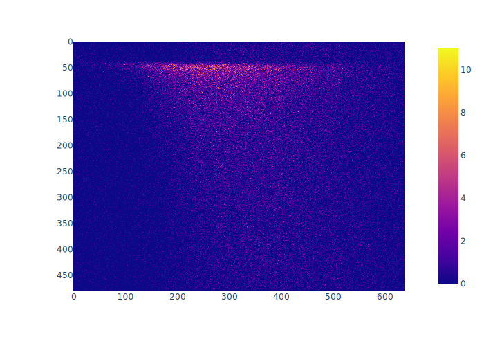
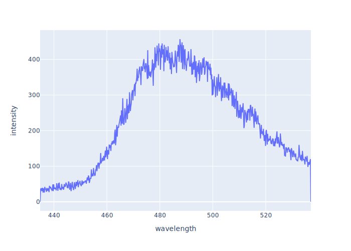

# Data Analysis Package for Takeuchi Lab <!-- omit in toc -->

<p align="center">
<a href="https://github.com/wasedatakeuchilab/tlab-analysis/actions?query=workflow%3ATest" target="_blank">
    
</a>
<a href="https://codecov.io/gh/wasedatakeuchilab/tlab-analysis" target="_blank">
    
</a>
</p>

**_tlab-analysis_** is a Python package for data analysis in Takeuchi laboratory.

- [Installation](#installation)
- [Getting started](#getting-started)
  - [TRPL measurement](#trpl-measurement)
    - [Load data](#load-data)
    - [Show streak image](#show-streak-image)
    - [H-figure](#h-figure)
    - [V-figure](#v-figure)
- [License](#license)

## Installation

```console
pip install git+https://github.com/wasedatakeuchilab/tlab-analysis
```

## Getting started

### TRPL measurement

#### Load data

```python
import tlab_analysis import trpl

# Load data from a raw file generated by u8167
filename = "data.img"
data = trpl.read_img(filename)

# Load data from buffer of a raw file
with open(filename, "rb") as f:
    data = trpl.read_img(f)
```

#### Show streak image

```python
import plotly.express as px

fig = px.imshow(data.to_streak_image())
fig.show()
```



You can also see it as a 3D surface plot.

```python
import plotly.graph_objects as go

fig = go.Figure(
    go.Surface(
        x=data.wavelength.unique(),
        y=data.time.unique(),
        z=data.to_streak_image(),
    )
)
fig.show()
```


#### H-figure

```python
from tlab_analysis import utils

hdf = data.aggregate_along_time()
fig = px.line(hdf, x="wavelength", y="intensity")
wavelength = hdf["wavelength"]
intensity = hdf["intensity"]
peak = utils.find_peak(wavelength, intensity)
fig.add_vline(peak[0])
fig.show()
```



Get its properties.

```python
peak_wavelength, peak_intensity = utils.find_peak(wavelength, intensity)
FWHM = utils.find_FWHM(wavelength, intensity)
```

#### V-figure

```python
vdf = data.aggregate_along_wavelength(wavelength_range=(470, 500))
fig = px.line(vdf, x="time", y="intensity")
fig.show()
```


Fit a double exponential function to the data to estimate its relaxation times.

```python
import numpy as np
from scipy import optimize

def double_exponential(t, a, tau1, b, tau2):
    return a * np.exp(-t / tau1) + b * np.exp(-t / tau2)


time = vdf["time"]
intensity = vdf["intensity"]
fitting_range = utils.determine_fit_range_dc(time, intensity)
index = time.between(*fitting_range)
params, cov = optimize.curve_fit(
    double_exponential,
    xdata=time[index],
    ydata=intensity[index],
    bounds=(0.0, np.inf),
    maxfev=10000,
)
vdf["fit"] = double_exponential(time[index], *params)
fig = px.line(vdf, x="time", y=["intensity", "fit"])
fig.show()
```


## License

[MIT License](./LICENSE)

Copyright (c) 2022 Shuhei Nitta
